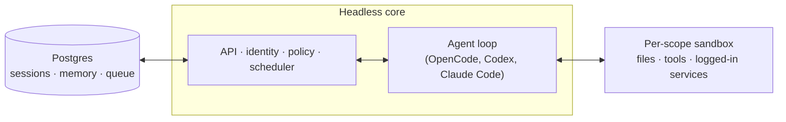

# Deskmate

A multiplayer agent harness for work. In Slack and on the web.

## What is Deskmate?

Most agents are designed like personal assistants. You can make one work for a whole
company, but it quickly gets complex. Deskmate is designed for startups. Employees each get
their own isolated workspace and work independently without affecting each other and
they can also collaborate with the agent in channels, group messages and projects.

Each person and each room has its own scoped memory, files, keychain view, permissions,
crons, web apps and durable sandbox.

It's built with open source in mind. Pick your own harness and model and switch between
them — OpenCode, Codex and Claude Code all drive the same core, so a deployment
isn't tied to any single vendor.

## Features

- **Personal and shared scopes.** People customize the agent to be _theirs_ and still
  work with it collaboratively in Slack channels and projects.
- **Slack and web.** The same identity and configuration carries between Slack and the
  web app.
- **Admin control.** Set org-level configuration, a security posture and which
  harnesses and models are available.
- **Web apps.** Spin up custom internal apps and publish them to the right people.
- **Shared skills.** Skills are scope-owned and shareable by grant, with admin-gated
  promotion to the whole org and skill packs imported from git repositories.
- **Background work.** Crons and watches run work while nobody's watching.

## What you can do with it

- Search internal notes, email, documents, databases and the web together
- Retrieve information from your company brain
- Build internal apps, publish them to the right people and keep their data current
- Learn your writing voice from past sends, then triage your inbox on a schedule —
  labels and reply drafts included
- Work in an existing repository: run tests, open PRs, monitor CI, check system logs
- Track a project in a shared channel and post updates and follow-ups

## Architecture



Every turn runs through a central core, which can use a variety of models and harnesses
to generate the response. A Postgres persistence layer holds user data, session history,
and other durable state. The agent has a small, fixed tool surface; one of those tools is
`execute`, which runs commands in the scope's own isolated sandbox — its durable computer,
where installed tools stay installed. The web UI, the admin panel and the public portal
are optional plugins over the core's HTTP API;
Slack is an optional in-process plugin that core starts
and supervises through a direct service client.

The core runs TypeScript directly on Node and uses Fastify for HTTP. The Slack plugin
uses Bolt; the web UI builds with Vite and renders with Lit.

The core itself is generic. Everything specific to one company — org config, custom tools
and skills, sandbox image, infrastructure — lives in a **deployment directory** that the
[`deskmate` CLI](./cli/README.md) validates and deploys. Every substrate (harness, session
store, sandbox, memory) sits behind an interface, so production implementations swap in
via one wiring file.

## Security

Deskmate's approach follows local coding agents like OpenCode, Codex and Claude Code: the
agent acts as the person it's working for, with their credentials and permissions and
everything it does is audited. An org picks one security posture, which narrower scopes
can only tighten:

- **Strict** — every harness tool call pauses for human approval, except the two
  no-effect turn enders.
- **Auto** (default) — a classifier screens provenance-labelled external data and tool
  results before they reach the model; a deployment can point that at its own screening
  proxy.
- **Dangerous** — no content screening, no pauses between tool calls.

The predeclared command policy — approval rules and hard denials for things like
recursive deletes or destructive SQL — applies in every posture, Dangerous included.

[`SECURITY.md`](./SECURITY.md) has the threat model, the operator assumptions and the
known limitations.

## Deployment

Deploying does not require a copy of this repository. The CLI supports local Docker
deployments and hosted deployments on Fly.io, AWS and GCP. `deskmate init`
materializes a deployment directory from the published package; this example selects AWS:

```bash
npm exec --yes --package=@p4dx/deskmate@<exact-version> -- \
  deskmate init . --org acme --target aws
```

Initialization materializes a deployment skill for an agent and walks through
infrastructure, web sign-in, connector credentials, optional Slack access, deployment,
and live verification — no source checkout required. Each hosted deployment runs in the
operator's own cloud account; initialization does not generate or enable deployment CI,
and this repository has no production deployment workflow. See
[`deployment.md`](./deployment.md) for the details.

## Going deeper

- [`docs/getting-started.md`](./docs/getting-started.md) — standing up a deployment for an org
- [`cli/README.md`](./cli/README.md) — the `deskmate` CLI and the deployment directory contract
- [`docs/deploy-directory.md`](./docs/deploy-directory.md) — the deployment directory in full
- [`.env.example`](./.env.example) — a starting `.env` for a local run; core reads many more
  variables than it lists and `deskmate init` computes the set a deployment actually needs
- [`plugins/`](./plugins) — the HTTP surfaces (web UI, admin, portal, sign-in broker)
- [`src/slack/`](./src/slack) — the Slack surface, an in-process plugin rather than a service
- [`fly/README.md`](./fly/README.md) — the sandbox base image and the agent-computer backends
- [`CONTRIBUTING.md`](./CONTRIBUTING.md) — how to propose a change

## Contributing

Issues are welcome on [GitHub](https://github.com/ItsMonarch04/desk-mate). Changes arrive as human-written proposals rather than finished patches — see [CONTRIBUTING.md](./CONTRIBUTING.md) for how that works.

## License

AGPL-3.0-only © 2026 Sidakpreet Singh — see [LICENSE](LICENSE). Version 3 only, not any later version.

---

**Version:** v0.19.2
